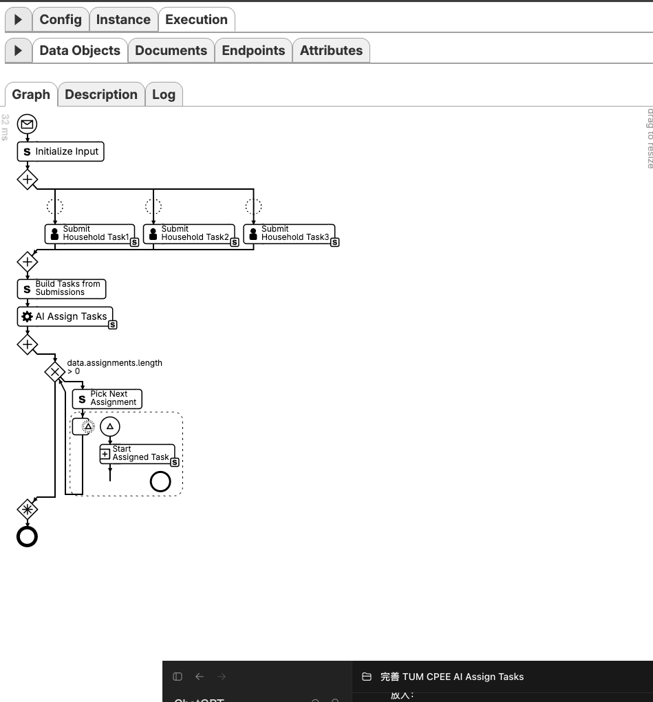
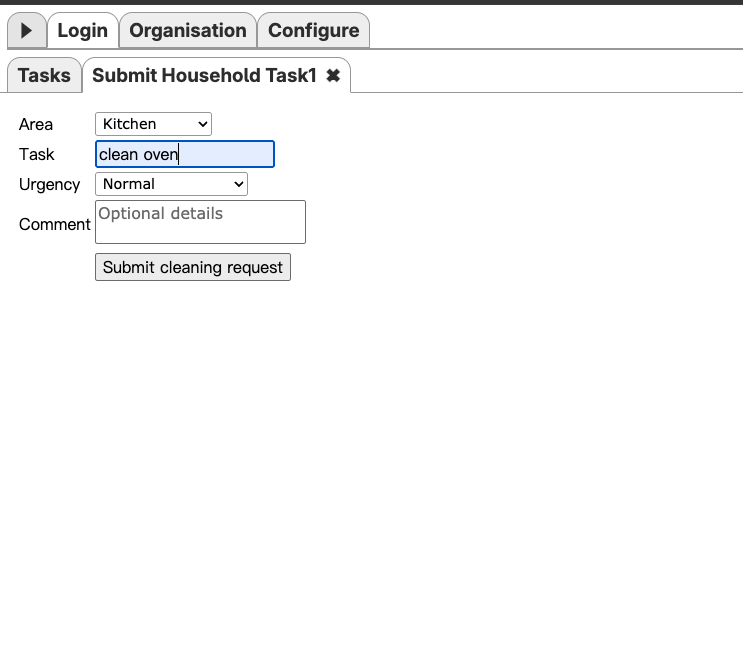
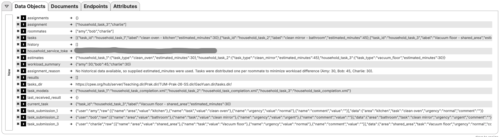
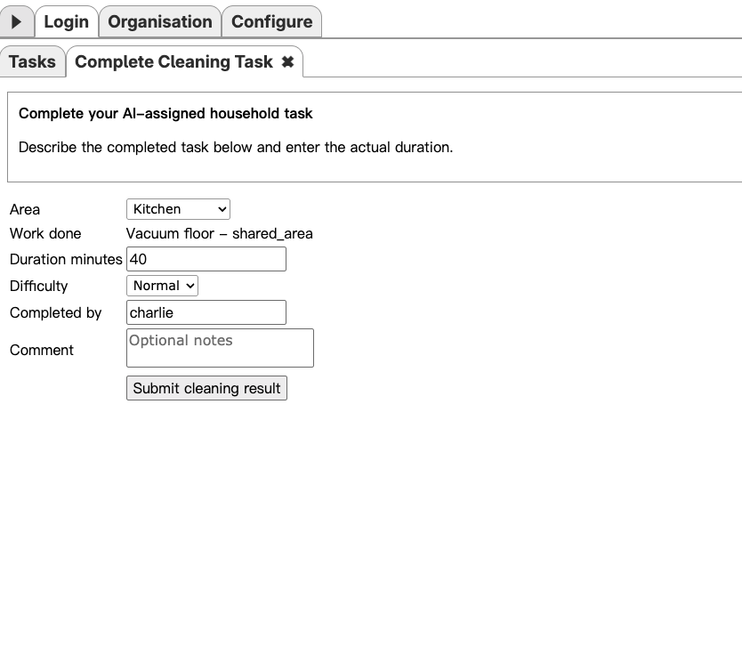
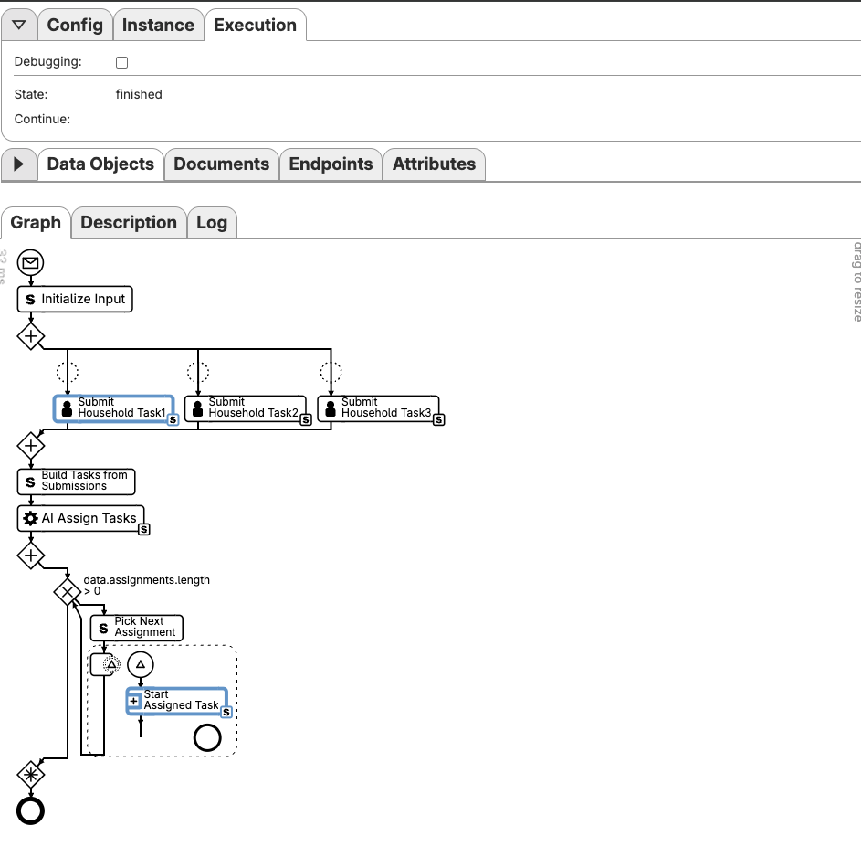

# AI-Assisted Household Task Assignment with CPEE

This project implements a simplified household task workflow with the **Cloud Process Execution Engine (CPEE)** and a **Qwen model hosted by TUM Morpheus**.

Three household members submit one cleaning task each. CPEE collects the submissions, calls the AI service, starts the assigned completion subprocesses in parallel, and waits for all results. The AI interprets the natural-language tasks and aims to balance the estimated workload.

## Scope

The final workflow intentionally focuses on one small, complete cycle:

1. Amy, Bob, and Charlie each submit one cleaning task.
2. CPEE converts the three form responses into task objects.
3. The AI classifies, estimates, and assigns every task.
4. CPEE starts one completion subprocess per assignment.
5. Each assigned member completes the task through the Worklist.
6. CPEE collects all results and finishes the main process.

Shopping, expense handling, and persistent cross-cycle history are outside the scope of this simplified version.

## Architecture

```text
Household members
        | Worklist submissions
        v
CPEE main workflow
        | HTTPS POST /assign
        v
Household AI service
        | TUM Morpheus API
        v
Qwen model
        | validated JSON
        v
CPEE parallel completion subprocesses
        | Worklist completion forms
        v
Collected results
```

CPEE owns the workflow state, user tasks, subprocess execution, and final results. The AI service is responsible for interpreting and assigning the submitted tasks.

## Repository Structure

```text
.
├── README.md
├── models/
│   ├── household_ai_workflow.xml
│   └── household_task_completion.xml
├── services/
│   └── household_ai_service.py
├── forms/
│   ├── household-task-submission-form.html
│   ├── cleaning-completion-form.html
│   └── organisation_household.xml
└── docs/screenshots/
```

## Workflow Details

### 1. Initialize the cycle

The main model is `models/household_ai_workflow.xml`. It initializes the three members and the data for one cycle:

```ruby
data.roommates = ['amy', 'bob', 'charlie']
data.tasks = []
data.history = []
data.results = []
```

All generated tasks use the shared `household_task_completion.xml` subprocess.

### 2. Collect submissions

Three Worklist activities run in parallel. Each member submits an area, a natural-language task description, an urgency level, and an optional comment. The submission roles identify the users but do not predetermine the later AI assignment.

### 3. Build the AI input

CPEE converts every form result into a task object with a stable ID:

```json
{
  "task_id": "household_task_1",
  "label": "clean oven - kitchen",
  "estimated_minutes": 30
}
```

The simplified workflow maps urgency to an initial fallback estimate:

| Urgency | Initial estimate |
|---|---:|
| `urgent` | 45 minutes |
| `normal` | 30 minutes |
| `next_week` | 20 minutes |

### 4. Assign tasks with AI

CPEE sends `roommates`, `tasks`, and `history` to the service. Qwen is instructed to understand labels and likely typos, infer a normalized `task_type`, use relevant historical durations when available, assign every task exactly once, and minimize the difference between the largest and smallest estimated workloads.

Example response:

```json
{
  "assignments": {
    "household_task_1": "amy",
    "household_task_2": "bob",
    "household_task_3": "charlie"
  },
  "estimates": {
    "household_task_1": {
      "task_type": "clean_oven",
      "estimated_minutes": 30
    }
  },
  "workload_minutes": {
    "amy": 30,
    "bob": 45,
    "charlie": 20
  },
  "reason": "The tasks were assigned one per roommate based on their estimated durations to keep the total workload as balanced as possible."
}
```

### 5. Validate and dispatch

The Python service validates input and output. It rejects missing or invented task IDs, unknown members, invalid durations, and malformed JSON. It then calculates the workload totals.

CPEE starts `household_task_completion.xml` with `task_id`, `assigned_to`, and `task_label`. Dynamic parallel branches use local CPEE data, so each branch preserves its own assignment. The child process uses `assigned_to` as the dynamic Worklist role and subject restriction.

The completion form displays the assigned task label and collects completion data. The child returns `task_result`; the parent uses `wait_running`, appends each returned result to `data.results`, and finishes after all branches complete.

## AI Service

`services/household_ai_service.py` uses the Python standard library and exposes:

```text
GET  /health
POST /assign
```

`/health` reports whether the service is running. `/assign` authenticates CPEE, validates the request, calls TUM Morpheus, validates the Qwen response, and returns the accepted assignment.

The default model is `cyankiwi/Qwen3.8-Flash-Next-AWQ-INT4`. It can be overridden with `MORPHEUS_MODEL`.

## Credentials and Tokens

The project uses two different credentials.

### Morpheus API key

`MORPHEUS_API_KEY` authorizes the Python service to call TUM Morpheus. It is supplied by TUM, remains on the server, and must never be stored in CPEE or committed to Git.

### Household service token

`HOUSEHOLD_SERVICE_TOKEN` protects this project's `/assign` endpoint. CPEE sends the same value as `Authorization: Bearer <token>`.

Generate a random token on the server:

```bash
umask 077
openssl rand -hex 32 > ~/.household_service_token
```

Load it into the service environment:

```bash
export HOUSEHOLD_SERVICE_TOKEN="$(cat ~/.household_service_token)"
```

The same value must be entered into the CPEE data element `household_service_token` for the running deployment. The repository version must contain only `placeholder`.

A new token is **not** required for every workflow instance. It should be rotated only after exposure or when intentionally revoked.

## Starting the Service

```bash
export MORPHEUS_API_KEY="<TUM Morpheus API key>"
export HOUSEHOLD_SERVICE_TOKEN="$(cat ~/.household_service_token)"
export HOUSEHOLD_PORT=8081
```

```bash
nohup env \
  MORPHEUS_API_KEY="$MORPHEUS_API_KEY" \
  HOUSEHOLD_SERVICE_TOKEN="$HOUSEHOLD_SERVICE_TOKEN" \
  HOUSEHOLD_PORT="$HOUSEHOLD_PORT" \
  python3 -u household_ai_service.py \
  > ~/household_ai_service.log 2>&1 &
```

Health check:

```bash
curl -sS https://lehre.bpm.in.tum.de/ports/8081/health
```

Expected response:

```json
{"status": "ok"}
```

Disconnecting SSH does not stop a service started with `nohup`.

## Deployment and Execution

1. Upload the forms and organisation model to the student's `public_html` directory.
2. Upload and start `household_ai_service.py` on the TUM teaching server.
3. Upload `household_task_completion.xml` to the Process Hub task directory used by the main model.
4. Load `household_ai_workflow.xml` in CPEE.
5. Replace the deployment-only service-token placeholder in CPEE with the current token.
6. Start the main instance and complete one submission task per member.
7. Complete the AI-assigned tasks and verify that the main instance reaches `finished`.

The supplied model URLs refer to this project's TUM teaching deployment and must be updated for another deployment.

## Screenshots

### Main workflow



### Task submission



### AI assignment data



### Assigned task in the Worklist



### Finished instance



## Security Notes

- Never commit `MORPHEUS_API_KEY` or a real `HOUSEHOLD_SERVICE_TOKEN`.
- Do not upload logs containing an `Authorization` header.
- Do not commit secret files, service logs, Vim swap files, or `.DS_Store` files.
- Rotate the household service token after accidental exposure.

## Known Limitations

- The workflow processes exactly three task submissions per cycle.
- The current version focuses on cleaning tasks and uses one shared completion subprocess.
- The service accepts historical data, but the current model does not persist history across workflow instances.
- Workload balancing is requested from the language model and validated structurally. The service calculates the totals but does not use a separate mathematical optimizer to prove global optimality.
- Deployment URLs are specific to the TUM teaching environment.

## Demonstrated Result

The tested workflow successfully collected three submissions, called the Morpheus-hosted Qwen model, produced validated assignments and estimates, routed every task to its assigned member, displayed the dynamic task label, executed the child processes concurrently, collected the results, and reached the CPEE `finished` state.
